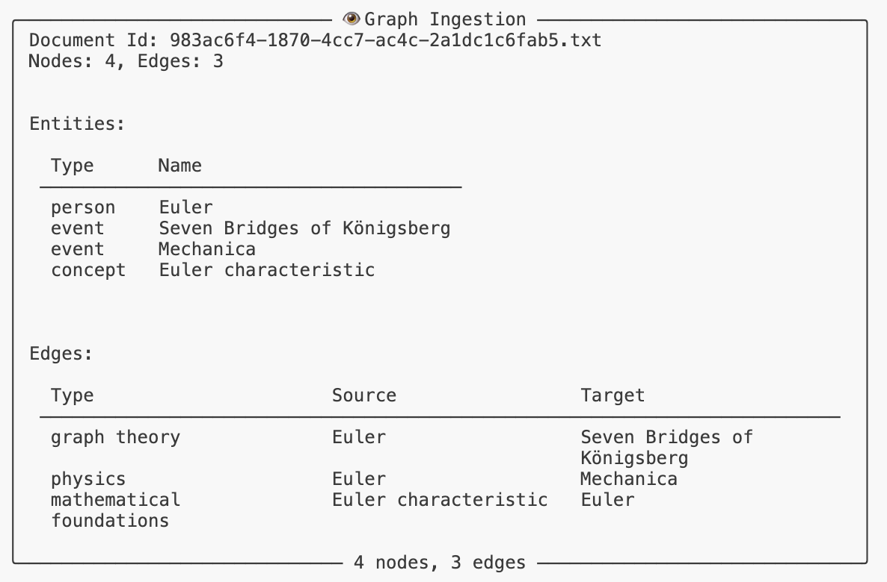

The `GraphRAG` class adds to the [[SemanticGraph]] by adding ingestion of text input. It uses the [[GraphExtraction]] to extract nodes and edges from text input, and then stores these in the underlying [[SemanticGraph]].

